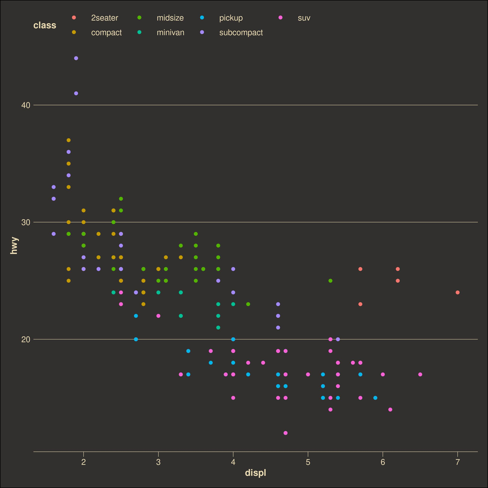

#darknerdthemes

I like to use dark themes when working. I like `gruvebox`, `nord`, and `everforest`. I think darkthemes could use a little more representation in the ggplot2 community. I do not follow the above themes strictly, I just hope to generate sensible dark themes. Please fork and make your own variations.

# Example

```r
# install
devtools::install_github("https://github.com/xvzftube/darknerdthemes")

# load
library(darknerdthemes)
library(ggplot2)

# example 1
p <- ggplot(mpg, aes(displ, hwy, color = class)) +
  geom_point() +
  nerd_theme_gruv() +
  scale_color_nerd(palette = "main")
ggsave('ex1.jpg', p, width = 8, height = 8)

# example 2
p <- ggplot(mpg, aes(displ, hwy, color = class)) +
  geom_point() +
  nerd_theme_nord()+
  scale_color_nerd(palette = "nord aurora")
ggsave('ex2.jpg', p, width = 8, height = 8)

# example 3
p <- ggplot(mpg, aes(displ, hwy, color = class)) +
  geom_point() +
  nerd_theme_nord()+
  scale_color_nerd(palette = "nord frost")
ggsave('ex3.jpg', p, width = 8, height = 8)

# example 4
p <- ggplot(mpg, aes(displ, hwy, color = class)) +
  geom_point() +
  nerd_theme_everforest()+
  scale_color_nerd(palette = "everforest")
ggsave('ex4.jpg', p, width = 8, height = 8)

# example 5
p <- ggplot(mpg, aes(displ, hwy, color = class)) +
  geom_point() +
  nerd_theme_gruv()
ggsave('ex5.jpg', p, width = 8, height = 8)

# example 6
p <- ggplot(mpg, aes(displ, hwy, color = class)) +
  geom_point() +
  nerd_theme_xvzf() +
  scale_color_nerd(palette = "xvzf")
ggsave('ex6.jpg', p, width = 8, height = 8)

```
## Example 1


## Example 2


## Example 3


## Example 4


## Example 5


